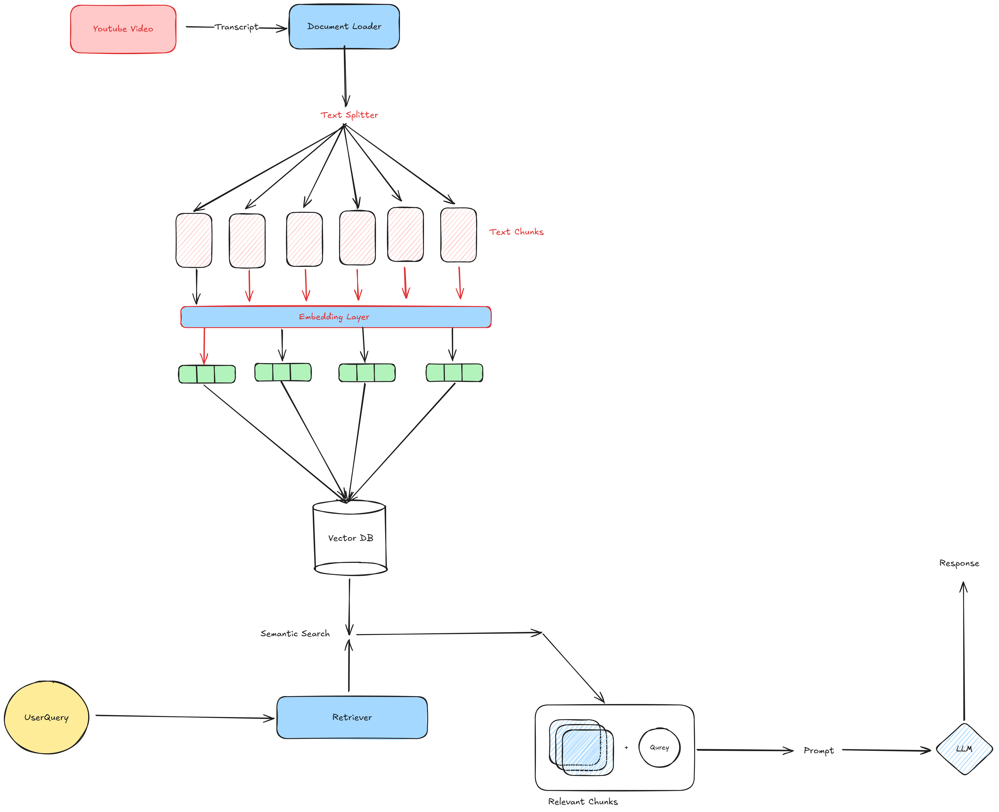
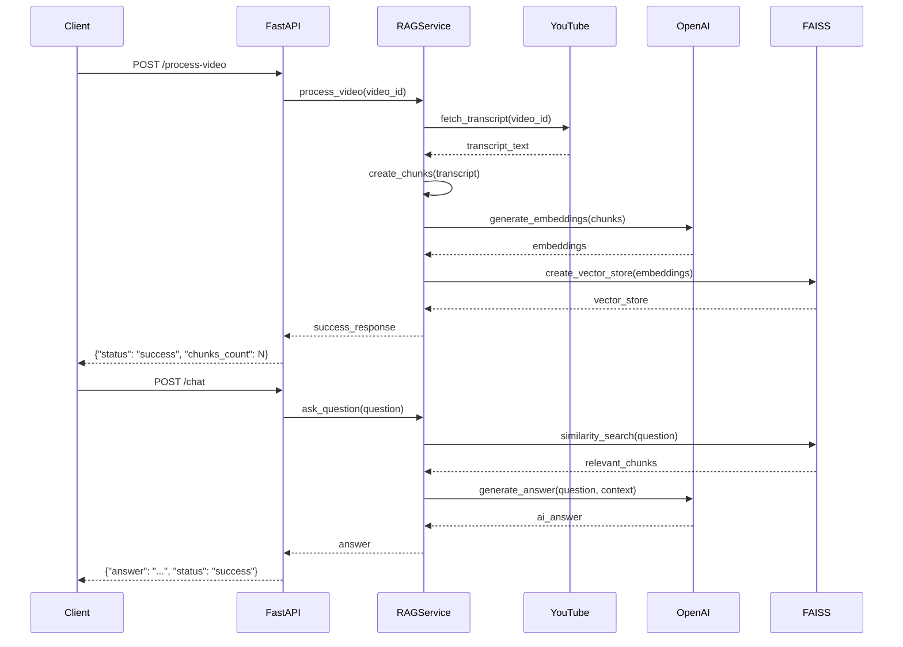

# 🎥 ChatTube - Know About Your Video

A comprehensive AI-powered application that enables intelligent conversations with YouTube video content using Retrieval-Augmented Generation (RAG). Built with FastAPI backend, Streamlit frontend, and deployed on AWS EC2.



## 🌟 Overview

ChatTube transforms YouTube videos into interactive knowledge bases. Users can paste any YouTube URL and ask questions about the video content, receiving accurate AI-generated answers based on the actual transcript.

### 🎯 Key Features

- **🎬 Smart Video Processing**: Automatic YouTube transcript extraction and analysis
- **🤖 AI-Powered Q&A**: GPT-4o-mini powered question answering with RAG
- **🔍 Vector Search**: FAISS-based similarity search for context retrieval
- **💻 Modern Frontend**: Beautiful Streamlit interface with real-time updates
- **🚀 Production Ready**: Dockerized and deployed on AWS EC2
- **📊 Real-time Status**: Live API monitoring and processing status
- **🌐 CORS Enabled**: Ready for cross-origin frontend integration

---

## 🏗️ Backend Architecture

### 🔧 Core Components

#### **1. FastAPI Application (`app/main.py`)**
- **Async Framework**: High-performance async/await support
- **Auto Documentation**: Interactive Swagger UI at `/docs`
- **CORS Middleware**: Cross-origin request handling
- **Global Exception Handling**: Comprehensive error management
- **Lifespan Management**: Proper startup/shutdown procedures

#### **2. RAG Service (`app/rag_service.py`)**
The heart of the application implementing the RAG pipeline:

```python
# RAG Pipeline Components
├── YouTube Transcript API    # Video transcript extraction
├── LangChain Text Splitter  # Document chunking (1000 chars, 200 overlap)
├── OpenAI Embeddings        # text-embedding-3-small model
├── FAISS Vector Store       # Similarity search with k=2
├── GPT-4o-mini             # Language model for answers
└── Custom Prompt Template   # Context-aware prompting
```

**RAG Workflow:**
1. **Transcript Extraction**: YouTube Transcript API fetches video captions
2. **Text Chunking**: RecursiveCharacterTextSplitter creates manageable chunks
3. **Embedding Generation**: OpenAI embeddings convert text to vectors
4. **Vector Storage**: FAISS stores embeddings for fast similarity search
5. **Query Processing**: User questions retrieve relevant context
6. **Answer Generation**: GPT-4o-mini generates contextual responses

#### **3. Data Models (`app/models.py`)**
Pydantic models for request/response validation:
- `ProcessVideoRequest`: Video ID validation (11 chars)
- `ProcessVideoResponse`: Processing status and metadata
- `ChatRequest`: Question with optional video ID
- `ChatResponse`: AI-generated answers
- `HealthResponse`: Service health status

#### **4. Logging System (`logger.py`)**
- **Rotating File Handler**: 5MB files, 3 backups
- **Console Output**: Real-time development feedback
- **Structured Logging**: Timestamp, logger name, level, message
- **Error Tracking**: Comprehensive error logging with stack traces

### 🚀 API Endpoints

| Endpoint | Method | Description | Request Body |
|----------|--------|-------------|--------------|
| `/` | GET | Basic health check | None |
| `/health` | GET | Detailed health status | None |
| `/status` | GET | Service and video status | None |
| `/process-video` | POST | Process YouTube video | `{"video_id": "string"}` |
| `/chat` | POST | Ask questions | `{"question": "string"}` |

### 🔄 Request Flow



---

## 🖥️ Frontend Architecture

### 🎨 Streamlit Application (`streamlit_app.py`)

A modern, responsive web interface built with Streamlit featuring:

#### **UI Components:**
- **Gradient Headers**: Eye-catching visual design
- **Real-time Status**: API connectivity and video processing status
- **Smart URL Processing**: Supports all YouTube URL formats
- **Interactive Chat**: Real-time conversation interface
- **Progress Indicators**: Loading states and success animations
- **Error Handling**: User-friendly error messages and recovery suggestions

#### **Key Features:**
- **URL Extraction**: Regex-based YouTube video ID extraction
- **API Integration**: RESTful communication with FastAPI backend
- **Session Management**: Chat history preservation
- **Responsive Design**: Works on desktop and mobile devices
- **Status Monitoring**: Live backend health monitoring

#### **URL Support:**
- `https://www.youtube.com/watch?v=VIDEO_ID`
- `https://youtu.be/VIDEO_ID`
- `https://www.youtube.com/embed/VIDEO_ID`
- `VIDEO_ID` (direct ID input)

### 🎯 User Experience Flow

1. **Video Input**: User pastes YouTube URL
2. **ID Extraction**: Automatic video ID parsing
3. **Processing**: Backend extracts and processes transcript
4. **Chat Interface**: Interactive Q&A with video content
5. **Real-time Updates**: Status monitoring throughout

---

## 🐳 Dockerization

### 📦 Docker Hub Repository
**Image**: [`shubhammahobia/chattube-know-your-video`](https://hub.docker.com/repository/docker/shubhammahobia/chattube-know-your-video/general)

### 🔧 Docker Configuration (`Dockerfile`)

```dockerfile
FROM python:3.11-slim

WORKDIR /app

# Install system dependencies
RUN apt-get update && apt-get install -y \
    gcc \
    && rm -rf /var/lib/apt/lists/*

# Copy requirements and install Python dependencies
COPY requirements.txt .
RUN pip install --no-cache-dir -r requirements.txt

# Copy application code
COPY . .

# Create logs directory
RUN mkdir -p logs

# Expose port
EXPOSE 8000

# Run the application
CMD ["python", "run_server.py"]
```

### 🚀 Docker Commands

```bash
# Build the image
docker build -t chattube-know-your-video .

# Run locally
docker run -p 8000:8000 \
  -e OPENAI_API_KEY=your_api_key \
  chattube-know-your-video

# Pull from Docker Hub
docker pull shubhammahobia/chattube-know-your-video:latest

# Run from Docker Hub
docker run -p 8000:8000 \
  -e OPENAI_API_KEY=your_api_key \
  shubhammahobia/chattube-know-your-video:latest
```

---

## ☁️ AWS EC2 Deployment

### 🖥️ Production Environment

**Backend Hosted On**: AWS EC2 Instance
- **Instance Type**: Optimized for CPU and memory
- **Operating System**: Ubuntu/Amazon Linux
- **Port**: 8000
- **Access**: Public IP with security group configuration

### 🔧 EC2 Setup Process

1. **Instance Configuration**:
   ```bash
   # Update system
   sudo apt update && sudo apt upgrade -y
   
   # Install Docker
   sudo apt install docker.io -y
   sudo systemctl start docker
   sudo systemctl enable docker
   sudo usermod -aG docker $USER
   ```

2. **Application Deployment**:
   ```bash
   # Pull the latest image
   docker pull shubhammahobia/chattube-know-your-video:latest
   
   # Run with environment variables
   docker run -d -p 8000:8000 \
     --name chattube-backend \
     --restart unless-stopped \
     -e OPENAI_API_KEY=your_openai_api_key \
     shubhammahobia/chattube-know-your-video:latest
   ```

3. **Security Group Configuration**:
   - **Inbound Rules**:
     - Port 8000: HTTP (0.0.0.0/0)
     - Port 22: SSH (Your IP)
     - Port 443: HTTPS (0.0.0.0/0)

4. **Domain & SSL** (Optional):
   - Configure Route 53 for custom domain
   - Use Let's Encrypt for SSL certificates
   - Set up nginx reverse proxy

### 📊 Monitoring & Maintenance

```bash
# Check container status
docker ps

# View logs
docker logs chattube-backend

# Update deployment
docker pull shubhammahobia/chattube-know-your-video:latest
docker stop chattube-backend
docker rm chattube-backend
# Run new container with updated image

# System monitoring
htop
df -h
free -h
```

---

## 🚀 Quick Start Guide

### 🔧 Local Development

1. **Backend Setup**:
   ```bash
   # Clone repository
   git clone <repository-url>
   cd ChatTube-Know-about-your-video
   
   # Install dependencies
   pip install -r requirements.txt
   
   # Set environment variables
   echo "OPENAI_API_KEY=your_key_here" > .env
   
   # Start backend
   python run_server.py
   ```

2. **Frontend Setup**:
   ```bash
   # Install Streamlit dependencies
   pip install streamlit requests
   
   # Update API URL in streamlit_app.py (if needed)
   # API_BASE_URL = "http://localhost:8000"  # For local
   # API_BASE_URL = "http://your-ec2-ip:8000"  # For EC2
   
   # Start frontend
   streamlit run streamlit_app.py
   ```

### 🌐 Production Access

- **Backend API**: `http://your-ec2-public-ip:8000`
- **API Documentation**: `http://your-ec2-public-ip:8000/docs`
- **Frontend**: Run Streamlit locally or deploy separately

---

## 📋 API Usage Examples

### 1. Process Video
```bash
curl -X POST "http://your-ec2-ip:8000/process-video" \
     -H "Content-Type: application/json" \
     -d '{"video_id": "dQw4w9WgXcQ"}'
```

**Response**:
```json
{
  "message": "Video processed successfully",
  "video_id": "dQw4w9WgXcQ",
  "chunks_count": 156,
  "status": "success"
}
```

### 2. Ask Question
```bash
curl -X POST "http://your-ec2-ip:8000/chat" \
     -H "Content-Type: application/json" \
     -d '{"question": "What is the main topic of this video?"}'
```

**Response**:
```json
{
  "answer": "The main topic of this video is...",
  "status": "success"
}
```

### 3. Check Status
```bash
curl -X GET "http://your-ec2-ip:8000/status"
```

**Response**:
```json
{
  "service_status": "initialized",
  "current_video_id": "dQw4w9WgXcQ",
  "ready_for_questions": true
}
```

---

## 🔧 Configuration

### 🌍 Environment Variables

| Variable | Description | Required | Default |
|----------|-------------|----------|---------|
| `OPENAI_API_KEY` | OpenAI API key | ✅ Yes | None |
| `LOG_LEVEL` | Logging level | ❌ No | INFO |
| `API_HOST` | Server host | ❌ No | 0.0.0.0 |
| `API_PORT` | Server port | ❌ No | 8000 |

### 📁 Project Structure

```
ChatTube-Know-about-your-video/
├── app/
│   ├── __init__.py
│   ├── main.py              # FastAPI application
│   ├── models.py            # Pydantic models
│   └── rag_service.py       # RAG implementation
├── logs/                    # Application logs
├── streamlit_app.py         # Frontend application
├── run_streamlit.py         # Frontend runner
├── run_server.py            # Backend runner
├── logger.py                # Logging configuration
├── requirements.txt         # Python dependencies
├── Dockerfile              # Docker configuration
├── pyproject.toml          # Project metadata
├── experiment.ipynb        # Development notebook
└── README.md              # This file
```

---

## 🔍 Troubleshooting

### Common Issues

1. **"No video has been processed"**
   - **Solution**: Call `/process-video` endpoint first
   - **Check**: Verify video ID is valid (11 characters)

2. **"Transcripts are disabled"**
   - **Solution**: Try a different video with available captions
   - **Note**: Some videos don't have transcripts

3. **OpenAI API errors**
   - **Check**: API key validity and quota
   - **Monitor**: Rate limits and usage

4. **Docker deployment issues**
   - **Verify**: Environment variables are set
   - **Check**: Port 8000 is available
   - **Monitor**: Container logs for errors

### 📊 Monitoring

```bash
# Backend health check
curl http://your-ec2-ip:8000/health

# Container logs
docker logs -f chattube-backend

# System resources
docker stats chattube-backend
```

---

## 🤝 Contributing

1. **Fork** the repository
2. **Create** a feature branch
3. **Make** your changes
4. **Test** thoroughly
5. **Submit** a pull request

### Development Setup

```bash
# Clone your fork
git clone https://github.com/your-username/ChatTube-Know-about-your-video.git

# Create virtual environment
python -m venv venv
source venv/bin/activate  # Linux/Mac
# or
venv\Scripts\activate     # Windows

# Install dependencies
pip install -r requirements.txt

# Run tests (if available)
python -m pytest

# Start development server
python run_server.py
```

---

## 📄 License

This project is licensed under the MIT License - see the LICENSE file for details.

---

## 🙏 Acknowledgments

- **FastAPI**: High-performance web framework
- **Streamlit**: Beautiful frontend framework
- **LangChain**: RAG implementation tools
- **OpenAI**: GPT-4o-mini and embeddings
- **FAISS**: Efficient similarity search
- **YouTube Transcript API**: Video transcript extraction
- **AWS EC2**: Reliable cloud hosting

---

**Built with ❤️ by [Shubham Mahobia](https://github.com/shubhammahobia)**

🚀 **Live Demo**: Contact for access to the deployed application
📧 **Support**: Create an issue for questions or bug reports
⭐ **Star**: If you find this project helpful!

---

*Last Updated: January 2025*
